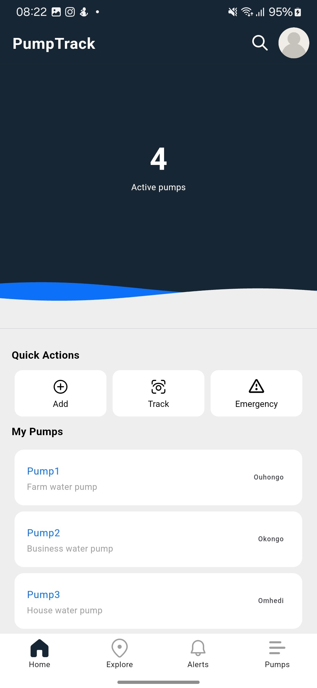
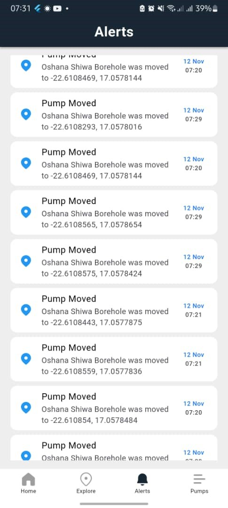
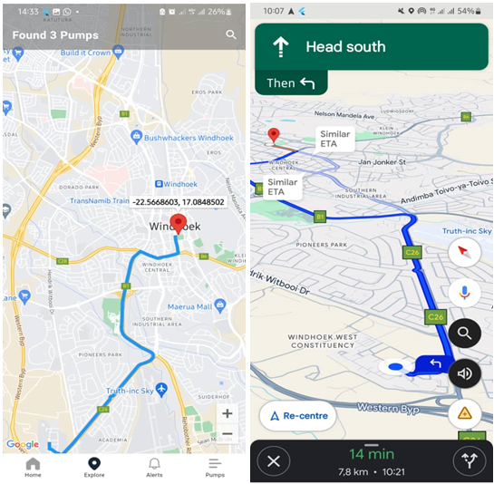

# PumpTrack

A Flutter mobile app for tracking borehole pumps in real time using GPS. PumpTrack helps teams monitor pump locations, receive alerts when pumps leave a geofence, and review historical movement and station[...]

 

---

## Table of contents

- [Features](#features)
- [Screenshots](#screenshots)
- [Demo](#demo)
- [Built with](#built-with)
- [Getting started](#getting-started)
  - [Prerequisites](#prerequisites)
  - [Install & run](#install--run)
  - [Configuring Firebase & Google Maps](#configuring-firebase--google-maps)
- [Project structure](#project-structure)
- [Contributing](#contributing)
- [Contact](#contact)
- [Notes](#notes)

---

## Features

- Real-time GPS location tracking of borehole pumps
- Geofencing with alerts when a pump moves outside defined boundaries
- Historical logs and per-pump activity history
- User authentication and role-based access (via Firebase)
- Clean, single-codebase UI built with Flutter

---

## Screenshots

A compact, polished gallery to preview the app. Click any thumbnail to view the full-size image.

<table>
  <tr>
    <td align="center">
      
      
<strong>Landing Screen</strong> <small>Quick status & login</small>

    </td>
    <td align="center">
      
      
<strong>Alerts</strong> <small>Geofence and movement alerts</small>

    </td>
    <td align="center">
      
      
<strong>Tracking</strong> <small>Map view & history</small>

    </td>
  </tr>
</table>

Tip: To make the README even more dynamic, consider adding a short GIF (150–300px width) that demonstrates a pump moving and triggering an alert. Place it above the gallery for an eye-catching hero preview.

---

## Demo

(Consider adding a short GIF or a link to a hosted demo here.)

---

## Built with

- Flutter — UI toolkit for building natively compiled apps
- Dart — programming language
- Google Maps API — maps, geolocation, and geofencing
- Firebase — Authentication, Realtime Database / Firestore, Cloud Functions, Storage

---

## Getting started

### Prerequisites

- Flutter installed (recommend latest stable). See: https://flutter.dev/docs/get-started/install
- A Firebase project for authentication and data storage
- Google Maps API key with Maps SDK enabled
- Xcode (macOS) / Android Studio or command-line Android SDK for building

### Install & run

1. Clone the repository
   git clone https://github.com/Ferrariboy99/PumpTrack-App.git
2. Change directory
   cd PumpTrack-App
3. Get dependencies
   flutter pub get
4. Configure native Firebase files:
   - Android: add `google-services.json` to `android/app/`
   - iOS: add `GoogleService-Info.plist` to `ios/Runner/`
5. Add your Google Maps API key (Android: `AndroidManifest.xml`, iOS: AppDelegate / plist)
6. Run the app
   flutter run

---

## Configuring Firebase & Google Maps

- Firebase:
  - Create a Firebase project.
  - Enable Authentication (email/password or other providers used).
  - Create a Firestore or Realtime Database and set appropriate rules.
  - Place `google-services.json` (Android) and `GoogleService-Info.plist` (iOS) in the app folders.

- Google Maps:
  - Enable the Maps SDK for Android and iOS in Google Cloud Console.
  - Restrict the API key to your app bundle identifiers or package names.
  - Insert the API key into your app’s native config files.

If you’d like, I can prepare a checklist of the exact files and keys to edit in this repo.

---

## Project structure (high level)

- lib/ — main application code (screens, models, services)
- android/ — Android native config and gradle files
- ios/ — iOS native config and Xcode project
- assets/ or Screenshots/ — images and media used in the app

(Adjust paths above to match your repo if different.)

---

## Contributing

Thanks for considering contributing! Suggested workflow:

1. Fork the repo
2. Create a feature branch: `git checkout -b feat/your-feature`
3. Commit changes with clear messages
4. Open a pull request with a description of your changes

Please add tests where appropriate and follow existing code style.

---

## Contact

For questions or support, email: festushelaoshatipamba@gmail.com

---

## Notes

- This repo contains work for ResearchProject2024 (final year research project).
